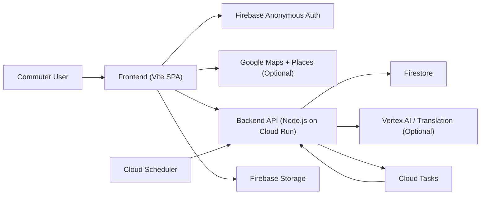

# SwiftFlow

SwiftFlow is a hackathon-ready commuter assistant for the Johor-Singapore border journey. It combines RTS booking, backup bus planning, taxi carpool pickup guidance, passport pre-check flow, smart notifications, green credits, and rewards into one mobile-first web experience.

The idea behind the product is simple: border commuters do not just need a ticket. They need confidence about departure time, fallback options, checkpoint readiness, and what to do next when conditions change.

## Why This Project Is Pitch-Worthy

SwiftFlow is designed around a strong demo narrative:

- **Mobility orchestration**: one place for train, bus, and shared ride decisions
- **Border readiness**: pre-check reminders, QR passes, and passport workflow support
- **Predictive alerts**: traffic, congestion, and trip timing prompts
- **Behavioral incentives**: carbon-aware credits and rewards
- **Practical deployment**: Cloud Run frontend + backend, Firebase auth/storage, Firestore state, Cloud Tasks/Scheduler

This makes it a good fit for hackathons focused on:

- smart cities
- mobility
- travel
- civic tech
- climate / sustainability
- AI-powered user assistance

## Demo Story

The strongest live demo flow is:

1. Open SwiftFlow with no login screen
2. Show silent guest onboarding through Firebase Anonymous Auth
3. Pick a route on the Explore page
4. Confirm an RTS booking
5. Show fallback bus and taxi pool options
6. Open notifications and explain predictive travel prompts
7. Complete passport pre-check and show the QR / barcode pass
8. Open profile to show the travel wallet view
9. Open rewards to show sustainability incentives

That sequence tells a clear story: **from planning to crossing to rewards**.

## Tech Stack

- **Frontend**: Vite, vanilla JavaScript, CSS
- **Backend**: Node.js HTTP server
- **Auth**: Firebase Anonymous Auth
- **Database**: Firestore
- **Storage**: Firebase Storage
- **Maps**: Google Maps JavaScript API + Places API (optional)
- **AI**: Vertex AI / Gemini
- **Translation**: Cloud Translation API (optional)
- **Background jobs**: Cloud Scheduler + Cloud Tasks
- **Hosting**: Google Cloud Run

## Repository Structure

```text
swiftFlow/
├── frontend/
│   ├── src/
│   ├── Dockerfile
│   ├── cloudbuild.yaml
│   └── .env.example
├── backend/
│   ├── src/
│   ├── Dockerfile
│   └── .env.example
├── deploy.sh
└── README.md
```

## Product Features

### 1. Explore and route selection

- select origin and destination
- view booked RTS trip
- compare against backup bus and taxi pool choices
- see road-style arrival estimates and departure timing

### 2. Booking confirmation

- confirm RTS booking
- confirm bus booking
- reserve taxi pool
- store confirmation codes and payment status

### 3. Passport pre-check

- SGAC / MDAC submission flow
- simulated sync and biometric verification states
- passport validity and trip-readiness cues
- QR / barcode pass surfaced in profile after submission

### 4. Alerts and notifications

- time-to-leave congestion alerts
- pre-check reminders before departure
- carbon reward notifications
- route comparison prompts

### 5. Profile and travel wallet

- commuter profile details
- profile photo upload to Firebase Storage
- active bookings summary
- trip history
- RTS / bus / passport pass display

### 6. Credits and rewards

- green travel credit ledger
- redemption catalog
- sustainability framing for commuter behavior

## Current Architecture



### How to read it

- The **frontend** is the user's travel wallet and booking interface.
- **Firebase Anonymous Auth** gives each browser/device a silent guest identity.
- The **backend** owns booking state, alerts, trip history, and profile updates.
- **Firestore** stores the per-user commuter state.
- **Firebase Storage** stores uploaded profile pictures.
- **Google Maps / Places** power autocomplete and pickup map experience when enabled.
- **Cloud Scheduler** and **Cloud Tasks** handle ticket expiry and reminder jobs.
- **Vertex AI / Translation** are optional enhancement layers for suggestions and multilingual support.

### Frontend

The frontend is a single-page mobile-first experience built with Vite and plain JS. It manages:

- page rendering
- interaction flow
- Firebase session startup
- local UI state
- Google Maps initialization
- fallback behavior when maps or backend are unavailable

### Backend

The backend provides:

- per-user state APIs
- booking confirmation / mutation endpoints
- profile persistence
- reward redemption
- alert acceptance
- reminder and expiration task endpoints

### Firebase and Firestore

- Firebase Anonymous Auth creates a silent guest identity
- Firestore stores per-user app state
- Firebase Storage stores uploaded profile pictures

### Cloud jobs

- Cloud Scheduler can trigger periodic ticket expiry cleanup
- Cloud Tasks can schedule reminder / lifecycle tasks for specific trips

## Prerequisites

Install these first:

- Node.js 20+ or 22+
- npm
- Google Cloud SDK (`gcloud`)
- a Google Cloud project
- a Firebase project

Check versions:

```bash
node -v
npm -v
gcloud --version
```

## Setup Overview

You need to configure four things:

1. Firebase Authentication
2. Firestore
3. Firebase Storage
4. Google Cloud deployment settings

If you only want local development first, you can ignore Cloud Run until later.

## Step 1: Clone and install

```bash
cd /Users/anisa/Desktop/SwiftFlow

npm --prefix frontend install
npm --prefix backend install
```

## Step 2: Firebase setup

Open Firebase Console for `YOUR_FIREBASE_PROJECT_ID`.

### 2.1 Authentication

Enable:

- `Anonymous`

Why this matters:

- SwiftFlow does not use a visible login form
- the frontend creates a silent guest session
- backend APIs expect a Firebase ID token

If this is not enabled, the frontend may load but protected backend calls will fail with:

```json
{"error":"Unauthorized","message":"Sign in is required before calling this API."}
```

### 2.2 Authorized domains

In Firebase Authentication settings, add:

- `localhost`
- `127.0.0.1`
- your deployed frontend domain, for example `YOUR_FRONTEND_URL`

If this is missing, authentication may fail only after deployment, which is frustratingly common.

### 2.3 Firestore

Create Firestore in **Native mode** if it is not already enabled.

### 2.4 Storage

Create the default Storage bucket.

Typical bucket format:

```text
YOUR_FIREBASE_PROJECT.firebasestorage.app
```

### 2.5 Storage rules

Make sure your Storage rules allow your authenticated Firebase user to upload profile photos.

If profile uploads fail, it is often because:

- Storage is not enabled
- rules are too strict
- anonymous auth is disabled
- the bucket name is wrong

## Step 3: Google Cloud setup

Enable required APIs:

```bash
gcloud services enable \
  run.googleapis.com \
  cloudbuild.googleapis.com \
  cloudscheduler.googleapis.com \
  cloudtasks.googleapis.com \
  translate.googleapis.com \
  iamcredentials.googleapis.com \
  containerregistry.googleapis.com \
  --project YOUR_PROJECT_ID
```

Optional but recommended:

- Maps JavaScript API
- Places API

If you want real map rendering and autocomplete, billing must also be enabled for the Maps project.

## Step 4: Backend environment

Example file:

- [backend/.env.example](/Users/anisa/Desktop/SwiftFlow/backend/.env.example)

Key variables:

- `PORT`
- `GOOGLE_CLOUD_PROJECT`
- `FIREBASE_PROJECT_ID`
- `VERTEX_AI_LOCATION`
- `GEMINI_MODEL`
- `TRANSLATION_ENABLED`
- `TRANSLATION_FALLBACK_LANGUAGE`
- `BACKEND_BASE_URL`
- `INTERNAL_TASK_SECRET`
- `CLOUD_TASKS_LOCATION`
- `CLOUD_TASKS_QUEUE`
- `TASK_INVOKER_SERVICE_ACCOUNT`
- `ALLOWED_ORIGINS`
- `ALLOW_UNAUTHENTICATED_DEV`
- `DEV_USER_ID`

### Local backend example

```bash
cd /Users/anisa/Desktop/SwiftFlow/backend

export PORT=3001
export GOOGLE_CLOUD_PROJECT=YOUR_PROJECT_ID
export FIREBASE_PROJECT_ID=YOUR_FIREBASE_PROJECT_ID
export VERTEX_AI_LOCATION=us-central1
export GEMINI_MODEL=gemini-1.5-flash
export TRANSLATION_ENABLED=true
export TRANSLATION_FALLBACK_LANGUAGE=en
export ALLOWED_ORIGINS="http://localhost:5173,http://127.0.0.1:5173"
export ALLOW_UNAUTHENTICATED_DEV=false

npm run dev
```

### Local debug-only fallback

If you want to bypass Firebase token enforcement during local debugging:

```bash
export ALLOW_UNAUTHENTICATED_DEV=true
export DEV_USER_ID=local-dev-user
```

Do not use that in production.

## Step 5: Frontend environment

Example file:

- [frontend/.env.example](/Users/anisa/Desktop/SwiftFlow/frontend/.env.example)

Required build-time values:

- `VITE_API_BASE_URL`
- `VITE_FIREBASE_API_KEY`
- `VITE_FIREBASE_AUTH_DOMAIN`
- `VITE_FIREBASE_PROJECT_ID`
- `VITE_FIREBASE_APP_ID`
- `VITE_FIREBASE_STORAGE_BUCKET`
- `VITE_GOOGLE_MAPS_API_KEY` (optional)

### Local frontend `.env`

Create `frontend/.env`:

```env
VITE_API_BASE_URL=http://localhost:3001
VITE_FIREBASE_API_KEY=YOUR_FIREBASE_WEB_API_KEY
VITE_FIREBASE_AUTH_DOMAIN=YOUR_FIREBASE_PROJECT.firebaseapp.com
VITE_FIREBASE_PROJECT_ID=YOUR_FIREBASE_PROJECT_ID
VITE_FIREBASE_APP_ID=YOUR_FIREBASE_WEB_APP_ID
VITE_FIREBASE_STORAGE_BUCKET=YOUR_FIREBASE_PROJECT.firebasestorage.app
VITE_GOOGLE_MAPS_API_KEY=YOUR_GOOGLE_MAPS_API_KEY
```

If you do not need maps locally, leave `VITE_GOOGLE_MAPS_API_KEY` empty.

## Step 6: Run locally

Start backend:

```bash
cd /Users/anisa/Desktop/SwiftFlow/backend
npm run dev
```

Start frontend in another terminal:

```bash
cd /Users/anisa/Desktop/SwiftFlow/frontend
npm run dev
```

Open:

```text
http://localhost:5173
```

## Recommended local development mode

Use:

- frontend -> local backend
- `VITE_API_BASE_URL=http://localhost:3001`
- backend `ALLOWED_ORIGINS="http://localhost:5173,http://127.0.0.1:5173"`

That is the least confusing setup.

## If local frontend calls the cloud backend

If your frontend runs locally but your backend is already on Cloud Run, your backend must allow both local origins:

```bash
ALLOWED_ORIGINS="https://YOUR_FRONTEND_URL,http://localhost:5173,http://127.0.0.1:5173"
```

## Deployment with `deploy.sh`

The preferred deployment path is:

```bash
cd /Users/anisa/Desktop/SwiftFlow
./deploy.sh
```

Before running it:

```bash
gcloud auth login
gcloud config set project YOUR_PROJECT_ID
```

Then export:

```bash
export PROJECT_ID="YOUR_PROJECT_ID"
export FIREBASE_PROJECT_ID="YOUR_FIREBASE_PROJECT_ID"
export REGION="us-central1"
export INTERNAL_TASK_SECRET="$(openssl rand -hex 32)"
export FIREBASE_API_KEY="your_firebase_web_api_key"
export FIREBASE_APP_ID="your_firebase_web_app_id"
export FIREBASE_AUTH_DOMAIN="YOUR_FIREBASE_PROJECT.firebaseapp.com"
export FIREBASE_STORAGE_BUCKET="YOUR_FIREBASE_PROJECT.firebasestorage.app"
export GOOGLE_MAPS_API_KEY="your_google_maps_api_key"
export EXTRA_ALLOWED_ORIGINS="http://localhost:5173,http://127.0.0.1:5173"
```

Then:

```bash
./deploy.sh
```

### What the script does

It:

1. enables required Google Cloud APIs
2. ensures the Cloud Tasks queue exists
3. ensures service accounts exist where needed
4. deploys backend to Cloud Run
5. reads the real backend URL
6. creates or updates the Cloud Scheduler job
7. builds frontend with the correct Vite values
8. deploys frontend to Cloud Run
9. reads the real frontend URL
10. patches backend `ALLOWED_ORIGINS` and `BACKEND_BASE_URL`

## Manual Cloud Run deployment

If you want to deploy manually:

### Backend

```bash
gcloud run deploy swiftflow-backend \
  --source backend \
  --region us-central1 \
  --project YOUR_PROJECT_ID \
  --allow-unauthenticated \
  --set-env-vars "GOOGLE_CLOUD_PROJECT=YOUR_PROJECT_ID,FIREBASE_PROJECT_ID=YOUR_FIREBASE_PROJECT_ID,VERTEX_AI_LOCATION=us-central1,GEMINI_MODEL=gemini-1.5-flash,TRANSLATION_ENABLED=true,TRANSLATION_FALLBACK_LANGUAGE=en,BACKEND_BASE_URL=,INTERNAL_TASK_SECRET=YOUR_SECRET,CLOUD_TASKS_LOCATION=us-central1,CLOUD_TASKS_QUEUE=swiftflow-trip-tasks,TASK_INVOKER_SERVICE_ACCOUNT=,ALLOW_UNAUTHENTICATED_DEV=false,ALLOWED_ORIGINS=http://localhost:5173,http://127.0.0.1:5173"
```

### Read backend URL

```bash
gcloud run services describe swiftflow-backend \
  --region us-central1 \
  --project YOUR_PROJECT_ID \
  --format='value(status.url)'
```

### Build frontend image

```bash
gcloud builds submit frontend \
  --config frontend/cloudbuild.yaml \
  --project YOUR_PROJECT_ID \
  --substitutions "_IMAGE=gcr.io/YOUR_PROJECT_ID/swiftflow-frontend,_VITE_API_BASE_URL=https://YOUR_BACKEND_URL,_VITE_FIREBASE_API_KEY=YOUR_FIREBASE_API_KEY,_VITE_FIREBASE_AUTH_DOMAIN=YOUR_FIREBASE_PROJECT.firebaseapp.com,_VITE_FIREBASE_PROJECT_ID=YOUR_FIREBASE_PROJECT_ID,_VITE_FIREBASE_APP_ID=YOUR_FIREBASE_APP_ID,_VITE_FIREBASE_STORAGE_BUCKET=YOUR_FIREBASE_PROJECT.firebasestorage.app,_VITE_GOOGLE_MAPS_API_KEY=YOUR_GOOGLE_MAPS_API_KEY"
```

### Deploy frontend

```bash
gcloud run deploy swiftflow-frontend \
  --image gcr.io/YOUR_PROJECT_ID/swiftflow-frontend \
  --region us-central1 \
  --project YOUR_PROJECT_ID \
  --allow-unauthenticated \
  --port 80
```

### Patch backend allowed origins

```bash
gcloud run services update swiftflow-backend \
  --region us-central1 \
  --project YOUR_PROJECT_ID \
  --update-env-vars "BACKEND_BASE_URL=https://YOUR_BACKEND_URL,ALLOWED_ORIGINS=https://YOUR_FRONTEND_URL,http://localhost:5173,http://127.0.0.1:5173"
```

## Background jobs

SwiftFlow supports:

- periodic expiry cleanup with Cloud Scheduler
- per-trip reminder / lifecycle tasks with Cloud Tasks

### Create Cloud Tasks queue

```bash
gcloud tasks queues create swiftflow-trip-tasks \
  --location=us-central1 \
  --max-dispatches-per-second=5 \
  --max-concurrent-dispatches=10 \
  --project YOUR_PROJECT_ID
```

### Create Scheduler job

```bash
gcloud scheduler jobs create http swiftflow-expire-tickets \
  --location us-central1 \
  --schedule "*/5 * * * *" \
  --time-zone "UTC" \
  --uri "https://YOUR_BACKEND_URL/api/cron/expire-tickets" \
  --http-method POST \
  --headers "X-SwiftFlow-Task-Secret=YOUR_SECRET" \
  --oidc-service-account-email "your-scheduler@YOUR_PROJECT_ID.iam.gserviceaccount.com" \
  --oidc-token-audience "https://YOUR_BACKEND_URL" \
  --project YOUR_PROJECT_ID
```

## Smoke tests

### Backend health

```bash
curl -s https://YOUR_BACKEND_URL/health
```

Expected:

```json
{"status":"ok","service":"swiftflow-backend"}
```

### Scheduler endpoint

```bash
curl -s -X POST https://YOUR_BACKEND_URL/api/cron/expire-tickets \
  -H "X-SwiftFlow-Task-Secret: YOUR_SECRET"
```

### Logs

```bash
gcloud run services logs read swiftflow-backend \
  --region us-central1 \
  --project YOUR_PROJECT_ID \
  --limit 100

gcloud run services logs read swiftflow-frontend \
  --region us-central1 \
  --project YOUR_PROJECT_ID \
  --limit 100
```

## Troubleshooting

### Problem: frontend says backend could not be reached

Likely causes:

- Cloud Run backend cold start
- wrong backend URL in frontend build
- CORS mismatch
- temporary network issue

Check:

```bash
curl -s https://YOUR_BACKEND_URL/health
```

### Problem: backend returns `Unauthorized`

Example:

```json
{"error":"Unauthorized","message":"Sign in is required before calling this API."}
```

Usually means:

- Anonymous auth is disabled
- frontend domain is missing in Firebase Authorized Domains
- frontend Firebase env values are wrong
- frontend reached backend before Firebase token setup finished

Fix:

1. enable Anonymous auth
2. add deployed frontend domain to Authorized Domains
3. confirm frontend env values
4. redeploy frontend

### Problem: profile photo upload fails

Check:

- Firebase Storage exists
- bucket name is correct
- Storage rules allow the signed-in Firebase user
- Anonymous auth is enabled

### Problem: Google Maps shows fallback card

Check:

- `VITE_GOOGLE_MAPS_API_KEY`
- Maps JavaScript API enabled
- Places API enabled
- referrer restrictions
- billing enabled

### Problem: deployed app works locally but fails in Cloud Run

Most common causes:

- wrong `ALLOWED_ORIGINS`
- wrong frontend build-time env values
- missing Firestore permissions for backend service account
- missing Firebase Authorized Domain

### Problem: first load fails only sometimes

Likely cause:

- backend cold start

Mitigation:

```bash
gcloud run services update swiftflow-backend \
  --region us-central1 \
  --project YOUR_PROJECT_ID \
  --min-instances 1
```

### Problem: `PERMISSION_DENIED` from Firestore

If Cloud Run backend and Firebase project are different, make sure the backend service account has Firestore access in the Firebase project.

### Problem: public repo accidentally exposed config

Before publishing:

1. confirm `.env` files are not tracked
2. confirm no real keys remain in tracked files
3. remove tracked `node_modules`
4. rotate any key that was ever committed

## Commands you will use often

### Local frontend build

```bash
npm --prefix frontend run build
```

### Backend syntax check

```bash
node --check backend/src/server.js
```

### Deploy with script

```bash
./deploy.sh
```

## Known limits

- payments are mock/demo only
- taxi pool is a simulated coordination flow
- passport and arrival-card flow is simulated, not government-connected
- transport provider integrations are not live
- anonymous users are scoped to browser/device

## Pitch Tips

When presenting SwiftFlow, keep the framing user-centered:

- **Problem**: border commuters face uncertainty, congestion, and fragmented tools
- **Solution**: one adaptive travel wallet with booking, readiness, fallback, and rewards
- **Differentiator**: it does not stop at booking; it supports the full crossing journey
- **Tech strength**: deployable architecture using Cloud Run, Firebase, tasks, scheduler, AI, and optional maps

Good one-line pitch:

> SwiftFlow is a smart commuter wallet that helps Johor-Singapore travelers plan, adapt, and cross the border with less friction.

## Related Files

- [deploy.sh](/Users/anisa/Desktop/SwiftFlow/deploy.sh)
- [backend/.env.example](/Users/anisa/Desktop/SwiftFlow/backend/.env.example)
- [frontend/.env.example](/Users/anisa/Desktop/SwiftFlow/frontend/.env.example)
